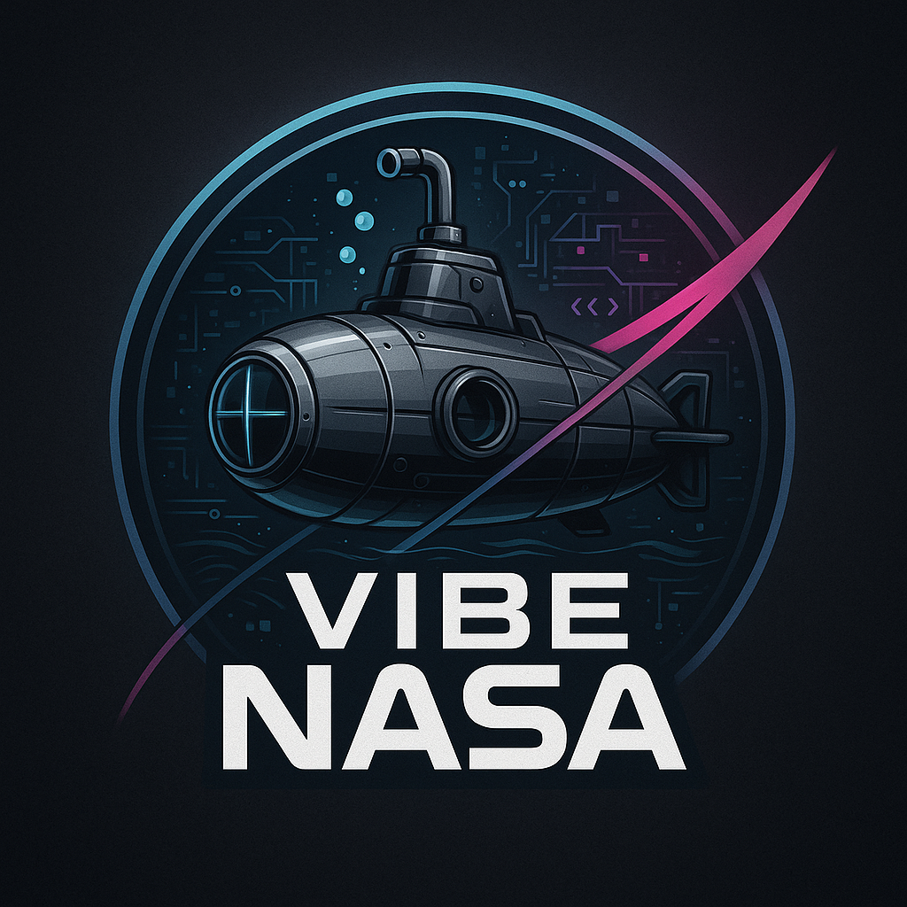

# VIBE NASA - LOFAR Spectrogram Playground

<div align="center">
  
</div>

VIBE NASA is a Reaserch Tool designed for exploring LOFAR spectrograms for feature extraction exploration and Optimisation.

The tool lets you load sample hydrophone captures (or your own WAV files), tweak STFT/TPSW processing parameters, and export the resulting LOFARgram for reporting or downstream analysis.

## Features

- Built-in sample recordings under `data/` plus WAV upload support.
- Tunable DSP chain (windowing, FFT length, overlap, decimation, noise floor).
- Custom colormaps including a sonar-style green palette.
- Preset manager with save/load/import/export (JSON).
- One-click downloads for spectrogram images and preset collections.

## Requirements

- Python 3.10+ (tested on macOS 15 / Apple Silicon).
- Required packages (see `requirements.txt`):
  - streamlit
  - numpy
  - scipy
  - librosa
  - soundfile
  - matplotlib

## Quick Start

```bash
python3 -m venv .venv
source .venv/bin/activate
pip install -U pip
pip install -r requirements.txt
streamlit run src/app.py
```

The app looks for bundled WAV files in `data/` and an optional logo at `assets/Logo.png`.

## Usage Tips

- Use the sidebar to select a built-in sample or upload your own mono/stereo WAV.
- Adjust the LOFAR parameters and watch the spectrogram update instantly.
- Click **Save preset** to capture current settings; download/export for later reuse.
- The **Download spectrogram** button saves a PNG with the current orientation and color scale.

## Project Layout

```
assets/          Branding/logo resources
data/            Sample WAV files for demo use
src/app.py       Streamlit UI and orchestration layer
src/transforms.py DSP helpers (TPSW normalization, LOFAR computation)
```

## Troubleshooting

- **No audio found**: add `.wav` files to `data/` or use the upload option.
- **Empty spectrogram**: reduce overlap or pick a longer clip; extremely short or silent signals can collapse the STFT.
- **Performance issues**: lower `nperseg`, decimation factor, or disable rotation to reduce rendering load.


# vibe-nasa
